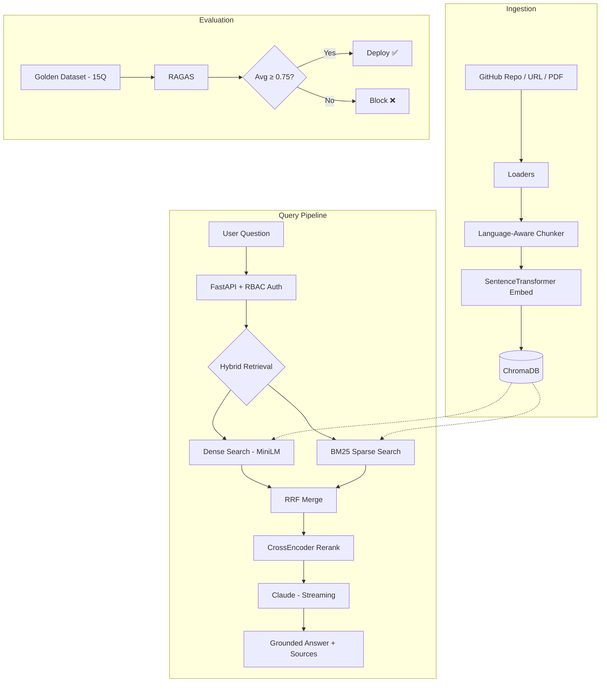

# DevDocs AI

**RAG over any GitHub repo or docs site — built for developers who want instant, grounded answers from their codebase.**

[](https://github.com/YOUR_USERNAME/DevDocs-AI/actions)
[](Dockerfile)
[](https://python.org)
[](LICENSE)

---

## The Problem

Developers waste **hours** searching through docs, README files, and source code to find answers. Existing search tools return keyword matches — not answers. LLMs hallucinate when they don't have your specific docs.

**DevDocs AI** solves this by combining:
- **Hybrid retrieval** (dense + sparse + reranking) for precision
- **Claude** for grounded, citation-backed answers
- **Streaming** for instant time-to-first-token
- **RAGAS evaluation** to prove it actually works

---

## Key Features

| Feature | Implementation |
|---------|---------------|
| 🔍 **Hybrid Search** | Dense embeddings (MiniLM) + BM25 sparse + RRF fusion |
| 🎯 **Cross-Encoder Reranking** | ms-marco-MiniLM-L-6-v2 for final precision |
| ⚡ **Streaming Answers** | Real-time token delivery (~300ms TTFT) |
| 🔒 **RBAC Auth** | JWT + bcrypt with user/admin roles |
| 📊 **RAGAS Eval Gate** | Faithfulness, Relevancy, Precision — CI blocks deploys below 0.75 |
| 🐳 **Production Docker** | Multi-stage, non-root, HEALTHCHECK, <200MB |
| 📈 **Observability** | LangSmith tracing + embedding cache metrics |
| 🚀 **Zero Cold Start** | Pre-warmed models on startup |

---

## Architecture



---

## Quick Start

### 1. Clone & Install

```bash
git clone https://github.com/YOUR_USERNAME/DevDocs-AI.git
cd DevDocs-AI
python3 -m venv venv && source venv/bin/activate
pip install -r requirements.txt
```

### 2. Configure

```bash
cp .env.example .env
# Edit .env with your keys:
#   ANTHROPIC_API_KEY=sk-ant-...
#   JWT_SECRET=your-random-secret
```

### 3. Ingest Documentation

```bash
# Ingest a GitHub repo
python scripts/ingest.py --source https://github.com/tiangolo/fastapi

# Ingest a docs URL
python scripts/ingest.py --source https://docs.python.org/3/tutorial/
```

### 4. Run

```bash
uvicorn app.main:app --reload
# Open http://localhost:8000 for the chat UI
# API docs at http://localhost:8000/docs
```

### Docker (Recommended)

```bash
docker compose up --build
# Or standalone:
docker build -t devdocs-ai . && docker run -p 8000:8000 --env-file .env devdocs-ai
```

---

## API Reference

### Auth

| Endpoint | Method | Body | Description |
|----------|--------|------|-------------|
| `/auth/register` | POST | `{username, password}` | Create account → JWT |
| `/auth/login` | POST | `{username, password}` | Login → JWT |
| `/auth/me` | GET | — | Current user info |

### Query (requires `user` role)

```bash
curl -X POST http://localhost:8000/ask \
  -H "Authorization: Bearer <token>" \
  -H "Content-Type: application/json" \
  -d '{"question": "How do I create a POST endpoint in FastAPI?", "k": 5}'
```

### Admin (requires `admin` role)

| Endpoint | Method | Description |
|----------|--------|-------------|
| `/ingest` | POST | Ingest GitHub repo, URL, or PDF |
| `/metrics` | GET | Operational metrics + cache stats |
| `/admin/users` | GET | List all registered users |

### Ops (public)

| Endpoint | Method | Description |
|----------|--------|-------------|
| `/health` | GET | Health check + chunk count |

---

## RAGAS Evaluation Scores

| Metric | Score | Threshold |
|--------|-------|-----------|
| Faithfulness | — | ≥ 0.75 |
| Answer Relevancy | — | ≥ 0.75 |
| Context Precision | — | ≥ 0.75 |
| **Average** | — | **≥ 0.75** |

> Run `python -m scripts.run_evals` to generate scores. Results saved to `docs/evaluation/ragas_results.json`.

---

## Tech Stack

| Layer | Technology | Why |
|-------|-----------|-----|
| **LLM** | Claude (Anthropic) | Best instruction-following for structured JSON output |
| **Embeddings** | all-MiniLM-L6-v2 | Fast, 384-dim, great quality/speed tradeoff |
| **Vector DB** | ChromaDB | Persistent, embedded, zero-config |
| **Sparse Search** | BM25 (rank_bm25) | Catches keyword matches that dense embeddings miss |
| **Reranker** | CrossEncoder ms-marco | Final precision gate — 10x more accurate than bi-encoder |
| **Framework** | FastAPI | Async, streaming, auto OpenAPI docs |
| **Auth** | JWT + bcrypt | Stateless, no session store needed |
| **Eval** | RAGAS + Gemini | Industry-standard RAG evaluation framework |
| **Tracing** | LangSmith | Full observability for LLM calls |
| **CI/CD** | GitHub Actions | lint → test → eval gate → Docker → Railway |
| **Deploy** | Docker + Railway | Multi-stage build, non-root, <200MB |

---

## Project Structure

```
DevDocs-AI/
├── app/
│   ├── main.py              # FastAPI app — routes, RBAC, middleware
│   ├── chain.py             # RAG chain — retrieval → Claude → response
│   ├── hybrid_retriever.py  # Dense + BM25 + RRF + CrossEncoder
│   ├── vectorstore.py       # ChromaDB + embedding cache
│   ├── bm25_retriever.py    # BM25 sparse search
│   ├── chunker.py           # Language-aware text splitting
│   ├── loaders.py           # GitHub, URL, PDF document loaders
│   ├── models.py            # Pydantic response schemas
│   ├── auth.py              # JWT auth + RBAC (user/admin)
│   ├── database.py          # SQLite user store
│   └── retriever_instance.py # Shared singleton + pre-warm
├── frontend/
│   ├── index.html           # Chat UI
│   ├── styles.css           # Dark mode + glassmorphism
│   └── app.js               # Streaming fetch + markdown render
├── scripts/
│   ├── ingest.py            # CLI ingestion tool
│   └── run_evals.py         # RAGAS evaluation harness
├── tests/
│   ├── test_api.py          # API + RBAC integration tests
│   └── golden_set.json      # 15-question eval dataset
├── .github/workflows/ci.yml # CI/CD pipeline
├── Dockerfile               # Multi-stage production build
├── docker-compose.yml       # One-command deployment
├── requirements.txt         # Python dependencies
└── pyproject.toml           # Ruff + pytest config
```

---

## Roadmap

- [ ] 💬 **Conversation memory** — multi-turn chat with context window
- [ ] 📚 **Multi-repo support** — switch between ingested repos
- [ ] 🔑 **OAuth providers** — GitHub/Google SSO
- [ ] 📊 **Analytics dashboard** — query patterns, popular docs
- [ ] 🧪 **A/B testing** — compare retrieval strategies with RAGAS

---

## License

MIT — see [LICENSE](LICENSE) for details.
