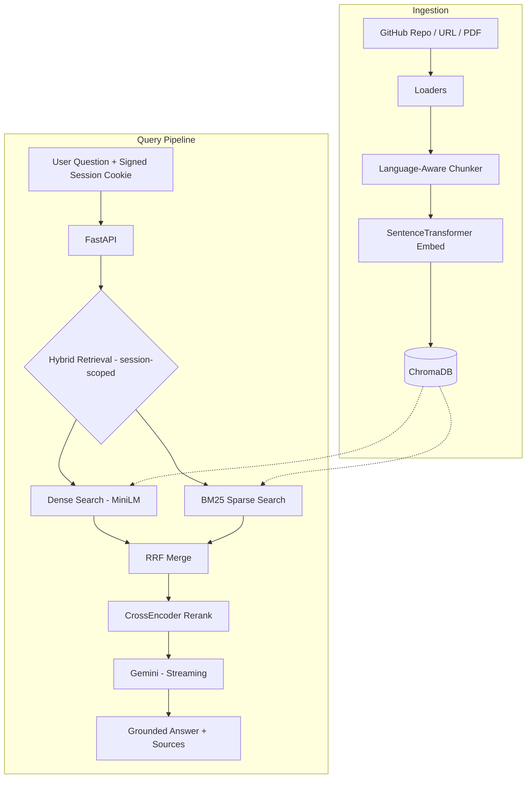

# DevDocs AI

**RAG over any GitHub repo or docs site — instant, grounded answers from your codebase, no sign-up required.**

[](https://github.com/23f3001800/DevDocs-AI/actions)
[](Dockerfile)
[](https://python.org)
[](LICENSE)

---

## The Problem

Developers waste **hours** searching through docs, README files, and source code to find answers. Existing search tools return keyword matches — not answers. LLMs hallucinate when they don't have your specific docs.

**DevDocs AI** solves this by combining:
- **Hybrid retrieval** (dense + sparse + reranking) for precision
- **Gemini** for grounded, citation-backed answers
- **SSE streaming** for instant time-to-first-token

---

## How It Works — Anonymous Per-Session

There is **no login, no account, no roles**. The server issues an opaque, signed `HttpOnly`, `SameSite=Lax` session cookie. The browser sends it automatically; client-supplied owner identifiers are ignored, so changing a header cannot impersonate another session.
The verified session is the owner of everything:

- **Private knowledge base** — chunks you ingest are visible only to your session.
- **Private chat history** — conversations and messages are scoped to your session.
- **Free daily limit** — each session gets `FREE_DAILY_LIMIT` (default **5**) free questions per UTC day on the server's Gemini key.
- **BYOK to continue** — send your own Gemini key as `X-Api-Key` and the daily limit no longer applies (your key, your quota).

Gemini is the only LLM provider. Without a server key the app falls back to a mock provider for local/offline work, and refuses to boot in production.

---

## Key Features

| Feature | Implementation |
|---------|---------------|
| 🔍 **Hybrid Search** | Dense embeddings (MiniLM) + BM25 sparse + RRF fusion |
| 🎯 **Cross-Encoder Reranking** | ms-marco-MiniLM-L-6-v2 for final precision |
| ⚡ **Streaming Answers** | Server-Sent Events, real-time token delivery (~300ms TTFT) |
| 🧑‍💻 **Anonymous sessions** | Signed HttpOnly cookie scopes a private KB + chat history — no account required |
| 🔑 **BYOK** | Bring your own Gemini key to answer past the free daily limit |
| 🐳 **Production Docker** | Multi-stage, non-root, HEALTHCHECK, CPU-only torch, models baked in |
| 📈 **Observability** | Optional LangSmith tracing + embedding cache metrics |
| 🚀 **Zero Cold Start** | Models baked into the image + pre-warmed on startup |

---

## Evaluation

We measure retrieval quality (Recall, MRR, Hit Rate) and answer grounding (Keyword Coverage) using a golden dataset of 20 questions against the FastAPI documentation. The baseline pipeline configurations demonstrate the value of hybrid retrieval and reranking:

| Configuration | Recall | Hit Rate | MRR | Keyword Coverage | Citation Coverage | Latency (ms) |
|---------------|--------|----------|-----|------------------|-------------------|--------------|
| **Dense** (MiniLM) | 0.882 | 0.950 | 0.900 | 0.918 | 1.000 | 31,731* |
| **BM25** | 0.857 | 0.950 | 0.900 | 0.906 | 1.000 | 2,676 |
| **Hybrid** (Dense + BM25) | **0.893** | 0.950 | **0.917** | 0.897 | 1.000 | 2,838 |
| **Hybrid + Reranking** | 0.855 | 0.950 | 0.892 | **0.932** | 1.000 | 5,724 |

*\*Note: The exceptionally high latency for the initial Dense run includes the LLM cold-start and API initialization overhead. Subsequent runs represent the true latency profile.*

---

## Architecture



---

## Quick Start

### 1. Clone & Install

```bash
git clone https://github.com/23f3001800/DevDocs-AI.git
cd DevDocs-AI
python3 -m venv venv && source venv/bin/activate
pip install -r requirements.txt
```

### 2. Configure

```bash
cp .env.example .env
# Edit .env with your key:
#   GOOGLE_API_KEY=...
```

### 3. Ingest Documentation

```bash
# Ingest a GitHub repo
python scripts/ingest.py --source https://github.com/tiangolo/fastapi

# Ingest a docs URL
python scripts/ingest.py --source https://docs.python.org/3/tutorial/
```

### 4. Run

```bash
uvicorn app.main:app --reload
# Open http://localhost:8000 for the chat UI
# API docs at http://localhost:8000/docs
```

### Docker (Recommended)

```bash
docker compose up --build
# Or standalone:
docker build -t devdocs-ai . && docker run -p 8000:8000 --env-file .env devdocs-ai
```

### Production configuration

The Docker image sets `APP_ENV=production`, which makes the app **fail-closed** —
it refuses to start unless these are set:

| Variable | Why it's required |
|----------|-------------------|
| `GOOGLE_API_KEY` | Without it the app would silently answer with the mock provider while `/health` stayed green. |
| `ALLOWED_ORIGINS` | Comma-separated CORS origins. Defaults to `*` — pin to your frontend origin. |
| `SESSION_SECRET` | At least 32 random characters in production; signs anonymous session cookies. |

`docker compose` overrides `APP_ENV` to `development` for local runs.

---

## API Reference

The first same-origin request receives a signed session cookie; the browser sends it
automatically. Add `X-Api-Key: <your-gemini-key>` to use your own key and bypass the
free daily limit.

### Query

```bash
curl -c /tmp/devdocs-cookie.txt -b /tmp/devdocs-cookie.txt -X POST http://localhost:8000/ask \
  -H "Accept: text/event-stream" \
  -H "Content-Type: application/json" \
  -d '{"question": "How do I create a POST endpoint in FastAPI?", "k": 5}'
```

Responses stream as **Server-Sent Events**: `token` (`{"text": "..."}`),
`sources` (`{"sources": [...]}`), then `done`. A failure mid-stream — including
hitting the free daily limit (`{"code": "limit_reached"}`) — arrives as an
`error` event, because once streaming starts the HTTP 200 is already committed.

| Endpoint | Method | Description |
|----------|--------|-------------|
| `/ask` | POST | Ask a question — streams the answer over SSE |
| `/usage` | GET | Today's free-question usage for this session |

### Ingest

| Endpoint | Method | Description |
|----------|--------|-------------|
| `/ingest` | POST | Queue a repo/URL/PDF ingest → **202** `{job_id}` |
| `/ingest/upload` | POST | Upload a PDF and queue it → **202** `{job_id}` |
| `/ingest/{job_id}` | GET | Poll job status (submitter only) |
| `/search-sources` | POST | Web search for candidate sources to ingest |
| `/sources/mine` | GET | List the sources this session has ingested |
| `/sources` | DELETE | Delete every chunk from a source you own |

Ingestion is asynchronous because cloning + chunking + embedding a real
repository takes minutes, and load balancers cut idle connections at ~230s.
Every submitted URL passes an **SSRF guard** (private / loopback / link-local /
cloud-metadata addresses are rejected) before the server makes any network call.

### Chat history

| Endpoint | Method | Description |
|----------|--------|-------------|
| `/conversations` | GET | List this session's conversations |
| `/conversations` | POST | Create a new (empty) conversation |
| `/conversations/{id}` | GET | Get a conversation and its messages (owner only) |
| `/conversations/{id}` | DELETE | Delete a conversation (owner only) |

### Ops (public)

| Endpoint | Method | Description |
|----------|--------|-------------|
| `/metrics` | GET | Operational metrics + cache stats |
| `/health` | GET | Health check + chunk count |

---

## Tech Stack

| Layer | Technology | Why |
|-------|-----------|-----|
| **LLM** | Gemini (`gemini-2.5-flash`) | Fast, cheap, long context; single-provider by design |
| **Embeddings** | all-MiniLM-L6-v2 | Fast, 384-dim, great quality/speed tradeoff |
| **Vector DB** | ChromaDB | Persistent, embedded, zero-config |
| **Sparse Search** | BM25 (rank_bm25) | Catches keyword matches that dense embeddings miss |
| **Reranker** | CrossEncoder ms-marco | Final precision gate — 10x more accurate than bi-encoder |
| **Framework** | FastAPI | Async, streaming, auto OpenAPI docs |
| **Sessions** | SQLite (per signed cookie owner) | Private KB + chat history, no accounts |
| **Tracing** | LangSmith (optional) | Full observability for LLM calls |
| **CI/CD** | GitHub Actions | lint → test → Docker → Azure |
| **Deploy** | Docker + Azure App Service | Multi-stage, non-root, CPU-only torch (~1.5 GB saved) |

---

## Project Structure

```
DevDocs-AI/
├── app/
│   ├── main.py              # FastAPI app — routes, sessions, middleware
│   ├── chain.py             # RAG chain — retrieval → Gemini → response
│   ├── llm_providers.py     # Gemini provider + mock fallback + streaming
│   ├── hybrid_retriever.py  # Dense + BM25 + RRF + CrossEncoder
│   ├── vectorstore.py       # ChromaDB + embedding cache
│   ├── bm25_retriever.py    # BM25 sparse search
│   ├── chunker.py           # Language-aware text splitting
│   ├── loaders.py           # GitHub, URL, PDF document loaders
│   ├── security.py          # SSRF guard for ingest URLs
│   ├── models.py            # Pydantic response schemas
│   ├── config.py            # Validated settings + fail-closed prod checks
│   ├── database.py          # SQLite — per-session usage, sources, chat history
│   └── retriever_instance.py # Shared singleton + pre-warm
├── frontend/
│   ├── index.html           # Chat UI
│   ├── styles.css           # Dark mode + glassmorphism
│   └── app.js               # SSE client + markdown render
├── scripts/
│   └── ingest.py            # CLI ingestion tool
├── tests/
│   ├── conftest.py          # Temp DB/Chroma isolation for the whole suite
│   ├── test_api.py          # API integration tests
│   ├── test_units.py        # Offline unit tests
│   ├── test_retrieval.py    # RRF fusion + rerank ordering + chunk IDs
│   └── test_stream.py       # SSE framing + stream fallback
├── .github/workflows/ci.yml # CI/CD pipeline
├── Dockerfile               # Multi-stage production build
├── docker-compose.yml       # One-command deployment
├── requirements.txt         # Python dependencies
└── pyproject.toml           # Ruff + pytest config
```

---

## Known Limitations

Stated plainly rather than discovered in production:

- **`/metrics` and in-memory rate limiting are per-process.** With more than one
  uvicorn worker or replica, `/metrics` reports whichever process served the
  request, and a `30/minute` limit becomes `30 × workers`. Set
  `RATE_LIMIT_STORAGE_URI=redis://...` to share the limiter; scrape Prometheus
  if you need cross-replica metrics.
- **Ingest jobs live in process memory.** A status poll that lands on a
  different worker returns 404. A shared store or a real task queue is the fix
  once you scale out.
- **SQLite is on the container filesystem.** On a PaaS without a mounted volume
  every redeploy wipes per-session state. Mount persistent storage at
  `/app/data`, or move to Postgres, before treating it as durable.
- **Session ids are unauthenticated.** Anyone who knows a session's UUID can read
  its KB and history — the id is a bearer secret, not a login. Keep it private.
- **The SSRF guard has a DNS-rebinding window.** The address is validated, then
  resolved again by `requests`/`git` when the fetch happens. Redirects are
  refused for the same reason. Pinning the resolved IP through the fetch
  (closing the rebinding window) is the stronger posture.

---

## Roadmap

- [ ] 📚 **Multi-repo support** — switch between ingested repos
- [ ] 📊 **Analytics dashboard** — query patterns, popular docs
- [ ] 🧪 **A/B testing** — compare retrieval strategies

---

## License

MIT — see [LICENSE](LICENSE) for details.
